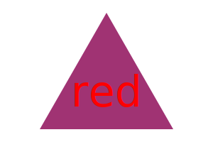

# SVG Logo Maker

## Description
SVG Logo Maker is a Node.js command-line application that allows users to generate simple logos for their projects. It prompts users to enter text, select text and shape colors, and choose a shape (circle, triangle, or square) for their logo. The generated logo is saved as an SVG file, which can be easily used in web projects.

## Features
- User-friendly command-line interface
- Supports custom text input (up to three characters)
- Provides a choice of text color (color keyword or hexadecimal number)
- Offers a selection of shapes: circle, triangle, or square
- Allows users to specify the color of the selected shape
- Generates SVG files that can be opened in web browsers

## Installation
1. Clone the repository to your local machine.
2. Navigate to the project directory.
3. Install dependencies using npm:

```bash
npm install
```

## Usage 
1. Run the application using the following command:
```bash
node index.js
```
2. Follow the prompt to:
    - Enter up to three characters for the text. 
    - Specify the text color (color keyword or hexadecimal number).
    - Choose a shape (circle, triangle, square).
    - Provide the color for the selected shape.
3. Once all prompts are completed, the application will generate the logo and save it as an SVG file named `logo.svg` in the `examples` directory.

## Example

Here's an example of a logo generated using the SVG Logo Maker:



## Walkthrough Video

For a demonstration of the application's functionality, please refer to the video linked here: (walkthrough video coming soon).

## Dependencies

- [Inquirer ](https://www.npmjs.com/package/inquirer): For collecting user inputs.
- [Jest ](https://www.npmjs.com/package/jest): For running tests.

## Links

[Repo](https://github.com/joelamaya19/SVG-Logo-Maker)

## License

N/A

